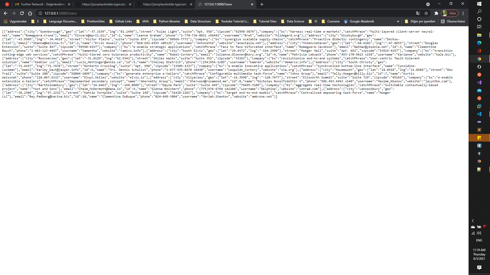
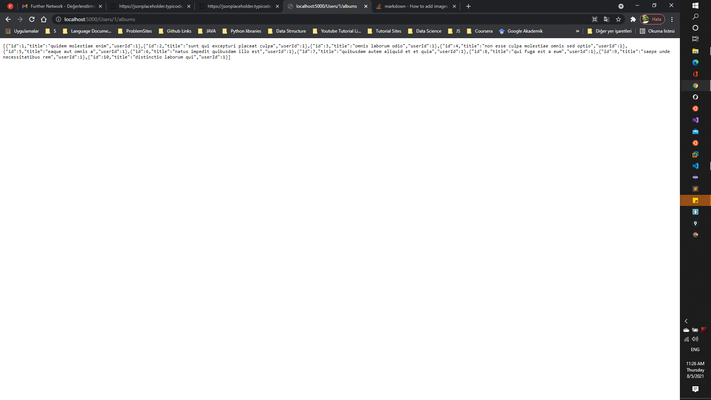
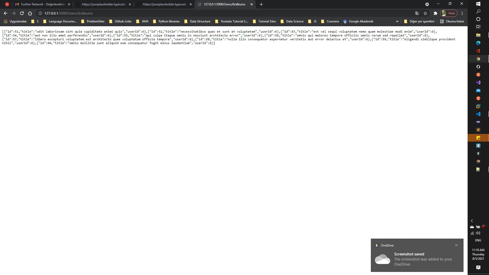
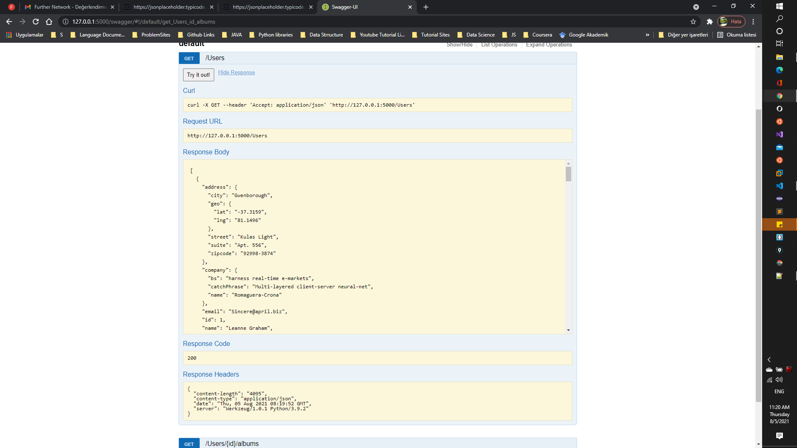
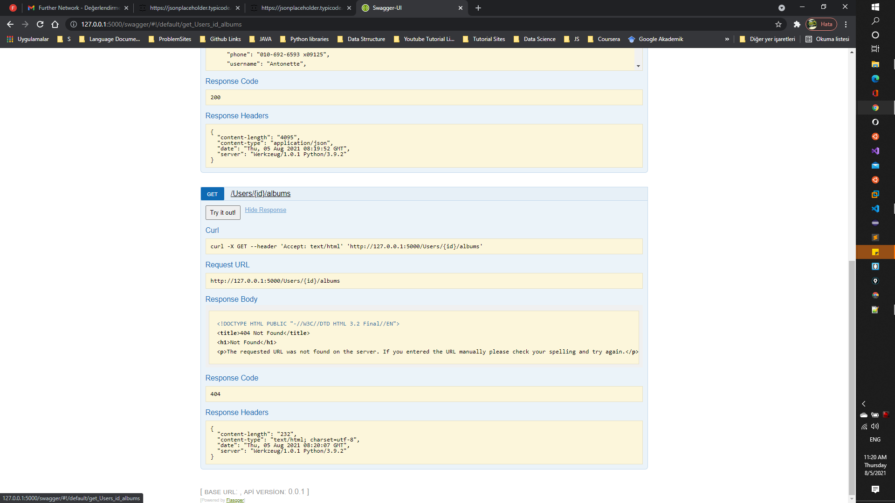

### Virtual Environment
https://flask.palletsprojects.com/en/2.0.x/installation/

### Installing requirements
```
app$ pip install -r requirements.txt
```

### Run Flask Rest Api
https://flask.palletsprojects.com/en/2.0.x/quickstart/

### Usage of Api

http://localhost:5000/Users


http://localhost:5000/Users/1/albums


http://localhost:5000/Users/6/albums


http://localhost:5000/swagger



**NOTE**:
Swagger id is not working but route working in search bar and postman
